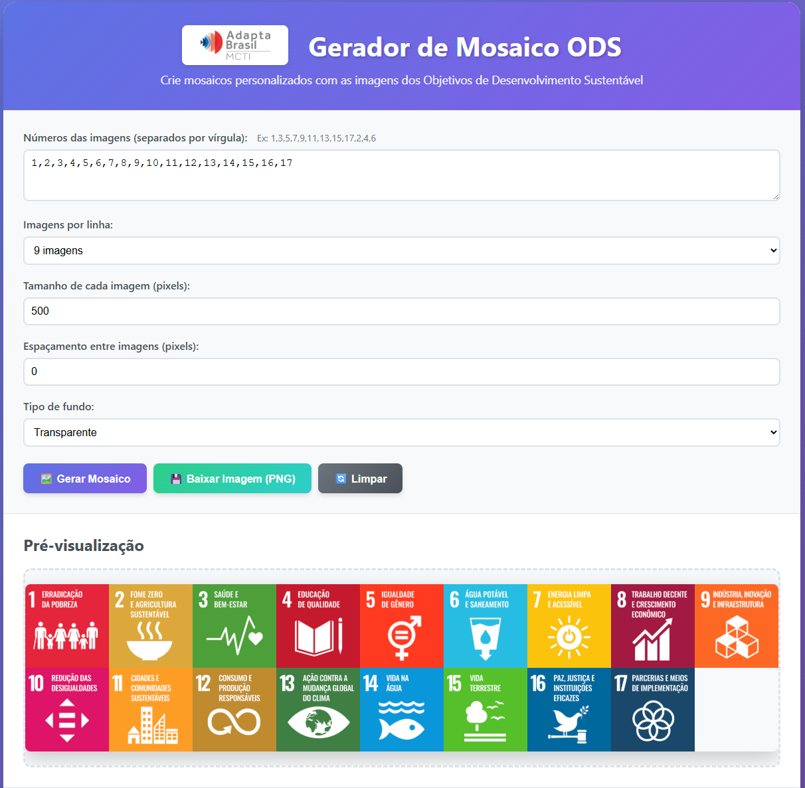

# Gerador de Mosaico ODS - Adapta Brasil MCTI

[](https://flameuss.github.io/gerador-ods/)
[](LICENSE)
[](package.json)

Aplicação web para criar mosaicos personalizados com as imagens dos 17 Objetivos de Desenvolvimento Sustentável (ODS) da ONU.

## 📸 Demonstração

[**Ver Demo Online →**](https://flameuss.github.io/gerador-ods/)



## ✨ Funcionalidades

- **🖼️ Criação de Mosaicos**: Combine até 17 imagens ODS em um único mosaico
- **📐 Layout Flexível**: Configure de 1 a 17 imagens por linha
- **🎨 Personalização Visual**:
  - Tamanho ajustável das imagens (50-500px)
  - Espaçamento configurável entre imagens (0-50px)
  - Fundo com cor sólida ou transparente
  - Controle de opacidade do fundo
- **💾 Download em PNG**: Exportação com suporte total a transparência
- **⌨️ Atalhos de Teclado**:
  - `Ctrl+G`: Gerar mosaico
  - `Ctrl+D`: Download
  - `Ctrl+L`: Limpar
- **📱 Design Responsivo**: Funciona em desktop, tablet e mobile

## 🚀 Início Rápido

### Instalação e Uso

**Acesse online:** https://flameuss.github.io/gerador-ods/

**Ou instale localmente:**

```bash
# Clone o repositório
git clone https://github.com/flameuss/gerador-ods.git

# Entre no diretório
cd gerador-ods

# Abra no navegador
# Opção 1: Abrir index.html diretamente
# Opção 2: Usar um servidor local
python -m http.server 8000
# ou
npx serve
```

### Como Usar

1. Abra o `index.html` no seu navegador
2. Selecione as imagens desejadas (clique nas miniaturas ou digite os números)
3. Configure o layout e estilo
4. Clique em "Gerar Mosaico"
5. Baixe o resultado em PNG

## 📂 Estrutura do Projeto

```
gerador-ods/
├── index.html                 # Página principal
├── README.md                  # Documentação
├── LICENSE                    # Licença MIT
├── .gitignore                # Arquivos ignorados
├── assets/
│   ├── css/
│   │   └── style.css         # Estilos da aplicação
│   ├── js/
│   │   ├── app.js            # Entrada principal
│   │   ├── controllers/      # Lógica de controle
│   │   │   └── MosaicController.js
│   │   ├── models/           # Lógica de negócio
│   │   │   └── MosaicModel.js
│   │   ├── views/            # Interface do usuário
│   │   │   └── MosaicView.js
│   │   └── utils/            # Utilitários
│   │       ├── ImageLoader.js
│   │       └── CanvasRenderer.js
│   └── images/
│       └── ods/              # Imagens ODS (1-17)
│           ├── 1.png
│           ├── 2.png
│           └── ...
└── docs/                     # Documentação adicional
    └── ARCHITECTURE.md       # Arquitetura MVC

```

## 🏗️ Arquitetura MVC

O projeto segue o padrão **Model-View-Controller (MVC)**:

### Model (`MosaicModel.js`)
- Gerencia dados e lógica de negócio
- Valida entradas do usuário
- Calcula dimensões do mosaico
- Processa configurações

### View (`MosaicView.js`)
- Manipula o DOM
- Gerencia interface do usuário
- Exibe feedback visual
- Captura eventos do usuário

### Controller (`MosaicController.js`)
- Coordena Model e View
- Processa ações do usuário
- Gerencia fluxo da aplicação
- Orquestra renderização

### Utilitários
- **ImageLoader**: Carregamento assíncrono com cache
- **CanvasRenderer**: Renderização otimizada no canvas

## 🎯 Como Usar

### 1. Seleção de Imagens
- **Método 1**: Clique nas miniaturas para adicionar
- **Método 2**: Digite os números separados por vírgula (ex: 1,3,5,7)

### 2. Configuração do Layout
- **Imagens por linha**: 1 a 17 (permite todas em uma única linha)
- **Tamanho**: 50px a 500px
- **Espaçamento**: 0px a 50px (0 = sem espaço entre imagens)

### 3. Personalização do Fundo
- **Cor sólida**: Escolha cor + opacidade
- **Transparente**: Fundo com canal alpha

### 4. Exportação
- Formato: PNG com transparência
- Nome: `mosaico-ods-[timestamp].png`

## 💡 Exemplos de Uso

### Mosaico Compacto (sem espaçamento)
- Todas as 17 imagens em linha única
- Espaçamento: 0px
- Ideal para banners horizontais

### Grid Tradicional
- 3x6 ou 4x5 imagens
- Espaçamento: 10px
- Perfeito para apresentações

### Linha Única
- 1 a 17 imagens horizontalmente
- Útil para cabeçalhos de sites

## 🛠️ Tecnologias

- **HTML5**: Estrutura semântica
- **CSS3**: Estilos modernos com gradientes
- **JavaScript ES6+**: Módulos nativos
- **Canvas API**: Renderização de imagens
- **Web APIs**: FileReader, Blob

## 🔧 Configuração Avançada

### Adicionar Novas Imagens

1. Adicione imagens PNG em `assets/images/ods/`
2. Nomeie sequencialmente: `18.png`, `19.png`...
3. Atualize `MosaicModel.js`:
```javascript
this.config = {
    availableImages: 19, // Atualizar número
    // ...
};
```

### Personalizar Estilos

Edite `assets/css/style.css`:
```css
/* Cores do tema */
header {
    background: linear-gradient(135deg, #5e72e4 0%, #825ee4 100%);
}

/* Tamanhos padrão */
.input-group input {
    padding: 10px;
}
```

## 🆕 Changelog

### v1.0.1 (Janeiro 2025)
- ✅ Suporte para até 17 imagens por linha
- ✅ Espaçamento 0 funcional para mosaicos compactos
- ✅ Melhorias na validação de configurações
- ✅ Otimização de renderização sem espaçamento

### v1.0.0 (Janeiro 2025)
- 🎉 Lançamento inicial
- 📐 Arquitetura MVC implementada
- 🎨 Suporte a transparência
- 💾 Export em PNG

## 🤝 Contribuindo

1. Fork o projeto
2. Crie uma branch (`git checkout -b feature/nova-funcionalidade`)
3. Commit suas mudanças (`git commit -m 'Add nova funcionalidade'`)
4. Push para a branch (`git push origin feature/nova-funcionalidade`)
5. Abra um Pull Request

## 📝 Licença

Este projeto está sob a licença MIT. Veja o arquivo [LICENSE](LICENSE) para mais detalhes.

## 🙏 Créditos

- Projeto desenvolvido para: [Adapta Brasil MCTI](https://adaptabrasil.mcti.gov.br/)
- Imagens ODS: [Nações Unidas Brasil](https://brasil.un.org/pt-br/sdgs)
- Ícones: Emojis nativos
- Inspiração: Agenda 2030 da ONU

## 📧 Contato

**Flameuss** - [GitHub](https://github.com/flameuss)

Link do Projeto: [https://github.com/flameuss/gerador-ods](https://github.com/flameuss/gerador-ods)

---

⭐ Se este projeto foi útil, considere dar uma estrela no GitHub!